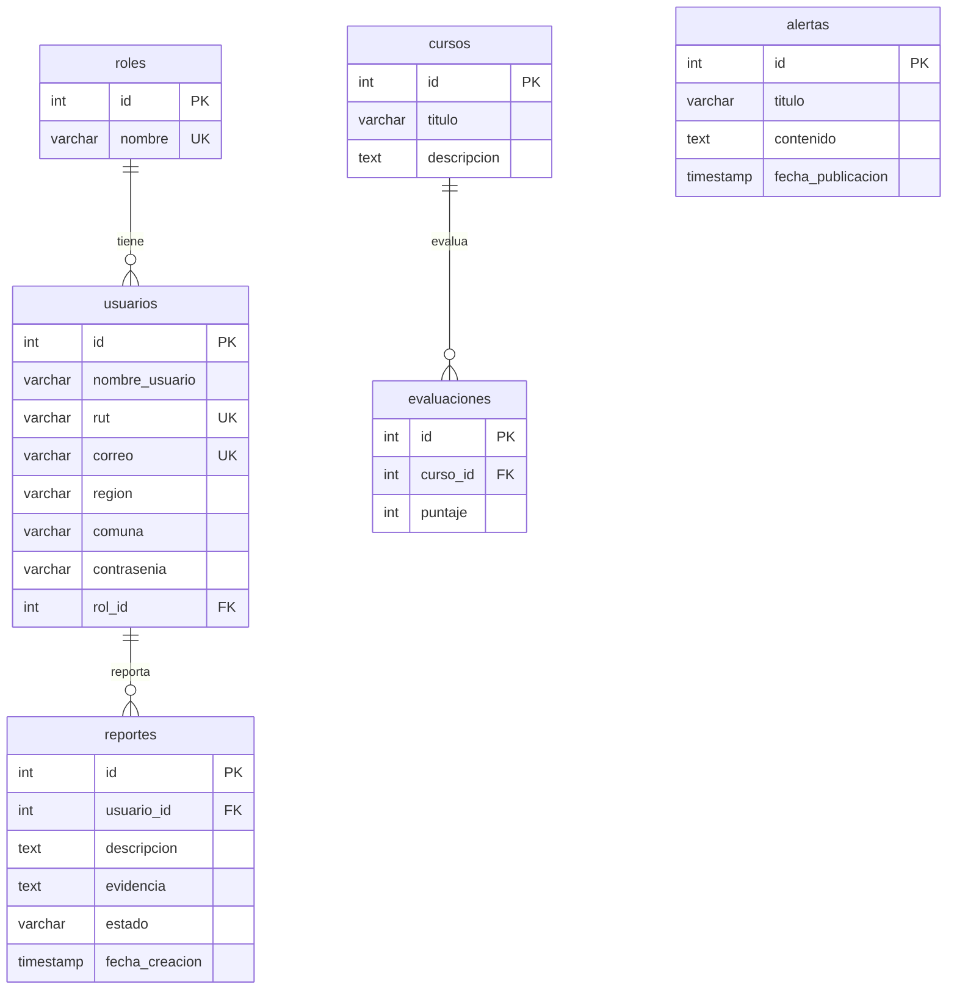
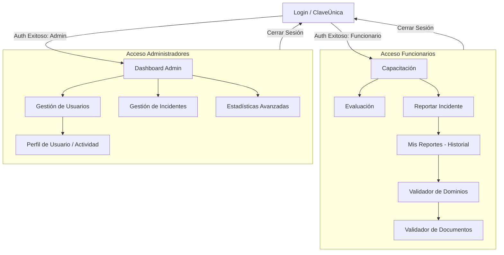
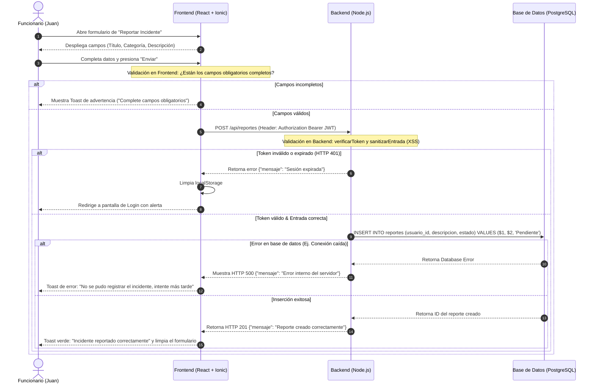

# Documentación Técnica Mejorada: Plataforma de Ciberseguridad Municipal

Este documento complementa y amplía las entregas parciales anteriores del proyecto, estructurando detalladamente los criterios de aceptación, el marco legal chileno aplicado, el análisis de usuarios, diagramas arquitectónicos y los flujos de tareas (task flows) con control de errores.

---

## 📋 1. Requerimientos Funcionales y Criterios de Aceptación ("Ejecutar Bien")

Para que una funcionalidad se considere "correctamente ejecutada" (cumpliendo con los estándares de control de calidad y rúbricas), debe satisfacer los siguientes criterios técnicos:

### RF 1: Registro e Inicio de Sesión de Usuarios
* **Criterio de Aceptación:**
  * El sistema debe validar que el RUT ingresado sea chileno válido (verificación de dígito verificador módulo 11) antes de enviarlo al servidor.
  * La contraseña debe encriptarse en tránsito (mediante HTTPS) y en reposo (usando `bcrypt` con factor de costo 10).
  * El correo electrónico debe seguir el formato estándar RFC 5322.
  * Si el inicio de sesión es exitoso, el servidor debe retornar un token JWT válido con expiración no mayor a 24 horas y redirigir según el rol del usuario (Administrador → Dashboard, Funcionario → Capacitación).
  * **Caso de Error:** Un intento fallido con credenciales inválidas debe retornar un mensaje genérico `"Usuario no encontrado o contraseña incorrecta"` con código HTTP 401, evitando la enumeración de usuarios.

### RF 2: Reporte de Incidentes de Ciberseguridad
* **Criterio de Aceptación:**
  * Cualquier funcionario autenticado debe poder enviar un reporte detallando: Título, Categoría (Phishing, Malware, etc.), Fecha y Descripción.
  * El formulario debe sanitizarse contra ataques XSS antes de persistirse en la base de datos (usando la función `xss` en el backend).
  * El reporte recién creado debe inicializarse con estado `"Pendiente"` y asociarse automáticamente al ID del usuario autenticado a través del JWT.
  * **Caso de Error:** Si la descripción se encuentra vacía o el token de sesión ha expirado, el sistema debe impedir el envío, eliminar el token corrupto del `localStorage` y redirigir al login.

### RF 3: Panel de Administración de Incidentes (Admin Only)
* **Criterio de Aceptación:**
  * Solo los usuarios con `rol_id = 1` (Administrador) pueden ver la lista completa de incidentes municipales, actualizar el estado (Pendiente → En Revisión → Resuelto) y eliminar reportes.
  * Los cambios de estado deben persistir inmediatamente en la base de datos y actualizar la línea de tiempo en el frontend.
  * Debe ser posible exportar los registros filtrados en formato CSV con caracteres compatibles (UTF-8).
  * **Caso de Error:** Si un funcionario intenta realizar una llamada `PUT` o `DELETE` al endpoint `/api/reportes/:id` por consola, el backend debe responder con un código de estado `403 Forbidden`.

### RF 4: Integración con Indicadores Económicos (EF 5)
* **Criterio de Aceptación:**
  * El backend debe actuar como proxy seguro llamando a la API externa de `mindicador.cl` y exponer un endpoint `/api/indicadores` protegido bajo JWT.
  * El dashboard del frontend debe mostrar las tarjetas con los valores actualizados de la UF, Dólar, Euro y UTM en pesos chilenos ($), formateados con separadores de miles.
  * **Caso de Error:** Si el servicio externo falla o está fuera de línea, el backend debe responder con un código HTTP 500 y un mensaje de fallback amigable, sin interrumpir el funcionamiento de los componentes locales del dashboard (los cuales mostrarán `"No disponible"` o `"Cargando..."` temporalmente).

---

## ⚖️ 2. Profundización de Leyes Chilenas Aplicadas al Sistema

La plataforma se alinea directamente con tres leyes fundamentales del Estado chileno:

| Ley / Norma | Enfoque Principal | Aplicación Específica en la Plataforma |
| :--- | :--- | :--- |
| **Ley 21.663** *(Marco de Ciberseguridad e Infraestructura Crítica)* | Obliga a las instituciones públicas a reportar incidentes de ciberseguridad al CSIRT nacional en plazos acotados. | El módulo de **Reportar Incidente** ([ReportarIncidente.tsx](file:///C:/Users/lopez/OneDrive/Escritorio/ww/Proyecto-web-y-movil/codigoProyecto/src/pages/ReportarIncidente.tsx)) permite al funcionario documentar la amenaza inmediatamente. La fecha y hora de auditoría quedan registradas automáticamente en la base de datos. |
| **Ley 21.180** *(Transformación Digital del Estado)* | Exige que los trámites y la comunicación del Estado se realicen de forma digital ("Cero Papel") resguardando la integridad y la autenticidad. | La plataforma digitaliza en su totalidad el canal de reporte de incidentes y las evaluaciones de capacitación, eliminando formularios impresos. Además, implementa autenticación centralizada compatible con estándares como **ClaveÚnica** ([LoginClaveUnica.tsx](file:///C:/Users/lopez/OneDrive/Escritorio/ww/Proyecto-web-y-movil/codigoProyecto/src/pages/LoginClaveUnica.tsx)). |
| **Ley 19.628** *(Protección de la Vida Privada / Datos Personales)* | Regula el tratamiento de datos personales en registros estatales. Exige confidencialidad y almacenamiento seguro de datos sensibles. | La base de datos protege los datos personales (RUT, Correo, Nombre) mediante encriptación de claves y un estricto **Control de Acceso Basado en Roles (RBAC)**. Con las correcciones de IDOR aplicadas en [server.js](file:///C:/Users/lopez/OneDrive/Escritorio/ww/Proyecto-web-y-movil/servidor/server.js), se garantiza que ningún funcionario pueda inspeccionar los reportes de incidentes o los datos personales de sus colegas. |

---

## 👥 3. Análisis de Usuarios y Personas (Contexto Ampliado)

Para optimizar la experiencia de usuario (UX) en el contexto municipal, se definieron dos arquetipos clave basados en la diversidad de aptitudes digitales y roles administrativos:

### Arquetipo 1: El Funcionario Reportante (Usuario Final)
* **Nombre de Ficción:** Juan Pérez (53 años).
* **Rol:** Administrativo en la Dirección de Obras Municipales (DOM).
* **Nivel de Alfabetización Digital:** Medio-Bajo. Familiarizado con procesadores de texto y correo electrónico básico, pero propenso a cometer errores de seguridad (hacer clic en enlaces sospechosos o reutilizar contraseñas sencillas).
* **Frecuencia de Uso:** Ocasional (2-3 veces por semana para módulos de capacitación; uso inmediato ante sospechas de incidentes).
* **Necesidades UX:**
  * Interfaz móvil y web simple, con botones grandes y tipografía legible.
  * Formulario de reporte directo, guiado paso a paso, sin tecnicismos complejos.
  * Confirmación visual inmediata (toasts y notificaciones de éxito) para saber que su reporte fue recibido.

### Arquetipo 2: La Administradora de TI y Seguridad (Administrador)
* **Nombre de Ficción:** Ing. Ana María (34 años).
* **Rol:** Encargada de Seguridad de la Información Municipal.
* **Nivel de Alfabetización Digital:** Alto. Experta en redes, sistemas operativos y gestión de riesgos tecnológicos.
* **Frecuencia de Uso:** Diario (uso intensivo desde computador de escritorio para monitoreo y auditoría).
* **Necesidades UX:**
  * Dashboard unificado que cargue métricas agregadas en tiempo real.
  * Herramientas eficientes de filtrado y búsqueda (búsqueda por ID, tipo o estado de incidentes).
  * Capacidad de cambiar el estado de múltiples incidentes y exportar reportes de auditoría en CSV.

---

## 📊 4. Diagramas del Sistema

### A. Diagrama de Entidad-Relación (Base de Datos)

### B. Diagrama de Navegación del Usuario (Frontend)

---

## 🔄 5. Flujos de Tareas (Task Flows) y Control de Errores

### Tarea: Reportar un incidente sospechoso de Phishing
El siguiente flujo describe las acciones del usuario, respuestas del sistema y alternativas ante errores de red o validación:

